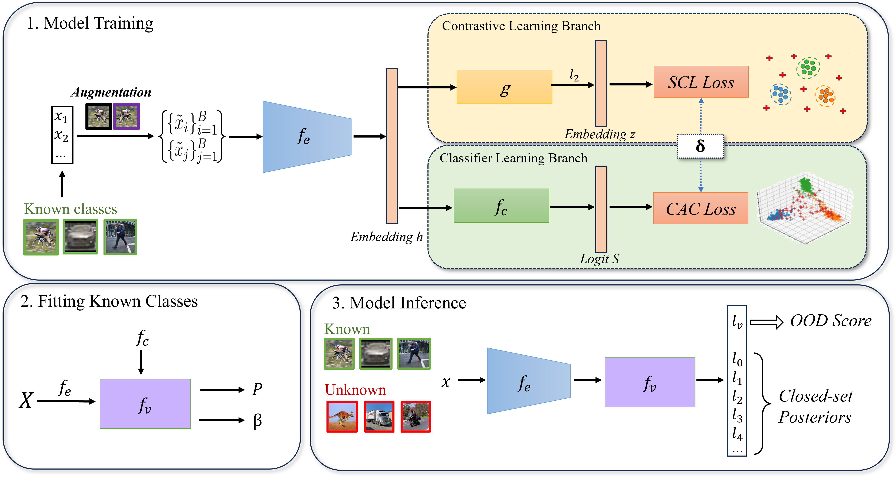

# S2CA: Supervised Contrastive Class Anchor Learning for Open Set Object Recognition in Driving Scenes

This repository is an implementation of S2CA framework, including code for data preprocessing, training and evaluation.

  

## Environments
Required packages are specified in [requirements.txt](requirements.txt)

## Datasets
The project involves two large-scale autonomous driving datasets: KITTI and nuScenes. These two datasets are public and can be downloaded from their websites.

[KITTI](https://www.cvlibs.net/datasets/kitti/index.php)

[nuScenes](https://www.nuscenes.org/)

## Quick Start
