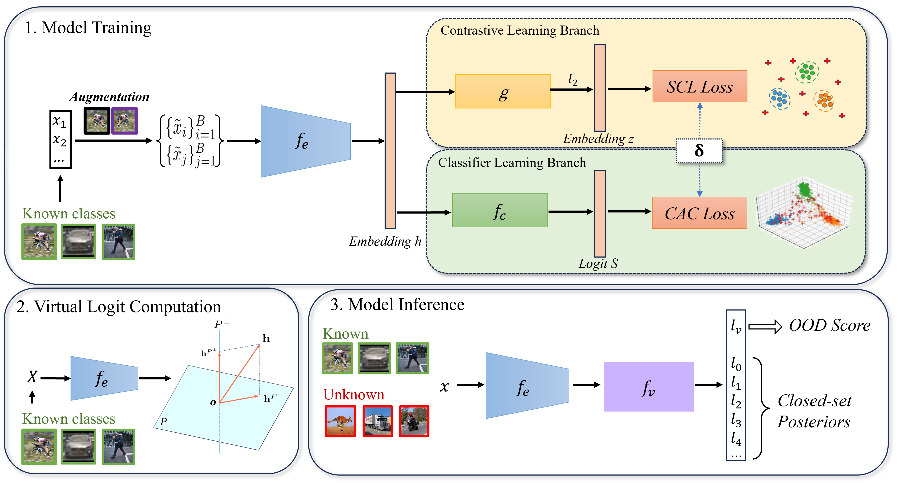

# S2CA: Supervised Contrastive Class Anchor Learning for Open Set Object Recognition in Driving Scenes

This repository is an implementation of S2CA framework, including code for data preprocessing, training and evaluation.
<p align="center">
  
</p>

## Environments

The code was developed with Python 3.9.13 and Pytorch 2.0.1. CUDA is required.

Required packages are specified in [requirements.txt](requirements.txt)

Simply use the following command to install all the packages listed.
```
pip install -r requirements.txt
```

## Datasets
The project involves two large-scale autonomous driving datasets: KITTI and nuScenes. These two datasets are public and can be downloaded from their websites.

[KITTI](https://www.cvlibs.net/datasets/kitti/index.php)

[nuScenes](https://www.nuscenes.org/)

## Quick Start

This project contains a variety of encoder networks and datasets. We now take DGCNN as an example to show how to use S2CA for Open Set Object Recognition.

First, download the KITTI dataset and decompress it to the `data preprocessing` folder.

Organize the downloaded files as follows:
```
├── kitti
│   │── ImageSets
│   │── training
│   │   ├──calib & velodyne & label_2 & image_2
│   │── testing
│   │   ├──calib & velodyne & image_2
│   
├── extract_partial_point_clouds_from_kitti.py
├── utils.py
├── visualize.py
├── calibration.py
```

To extract point cloud for each instances, run:
```
python kitti_pt.py
```

Then we can start Model Training.

```
python training.py --dataset kitti --DATA_PATH XXXXXXXXXX
```

Once the closed-set finished, we can move to evaluation (Fitting Known Classes and Model Inference). We provide a pretrained model for quick demonstration. You can simply run:

```
python evaluation.py --dataset kitti --DATA_PATH XXXXXXXXXX --OPEN_PATH XXXXXXXXXX --ckpt demo.pth
```

After the code is executed, we will get the performance of S2CA and a figure showing the OOD score distribution of known classes and unknown classes.

<p align="center">
  
</p>


